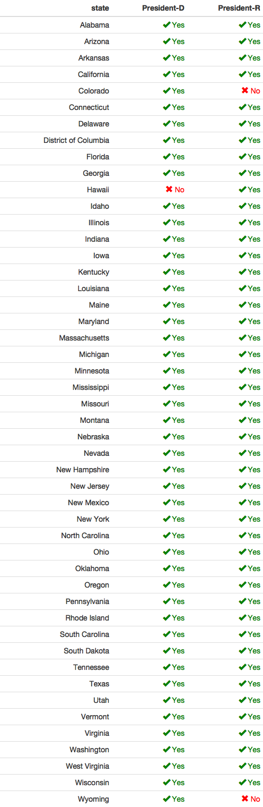
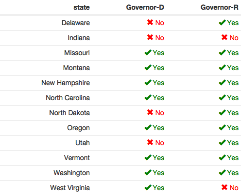
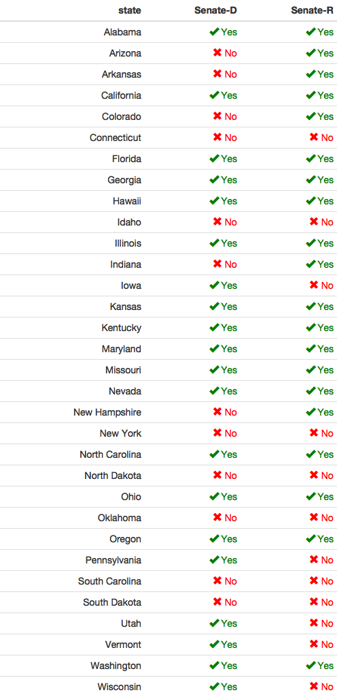

```{r setup, include=FALSE}
knitr::opts_chunk$set(echo = TRUE)
library(dplyr)
```


## Candidate-level data

`2016_primary_long` has vote and vote share at the candidate level, for state-wide candidate races (President, Senate, Governor)

```{r, echo = FALSE}
readRDS("data/output/2016-primary_long.Rds") %>% 
  select(office, st, county, fips, candidate, party, vote, everything())
```


A random sample
```{r, echo = FALSE}
sample_n(readRDS("data/output/2016-primary_long.Rds"), 10) %>% 
  select(office, st, county, fips, candidate, party, vote, everything())
```


## County-level data 


`2016_primary_wide` has the vote share of the major presidential candidates at the county level.

```{r, echo = FALSE}
sample_n(readRDS("data/output/2016-primary_president_wide.Rds"), 10)
```


## Data Construction

Almost all of the data comes from (https://github.com/Prooffreader/election_2016_data), which scraped Politico election results. Most of the Politico results come from the AP feed. 


## Missings of Races

Some primary races are missing due to lack of county-level data from AP. Only looking at Democratic and Republican Candidates,


### President




### Senate




### Governor



