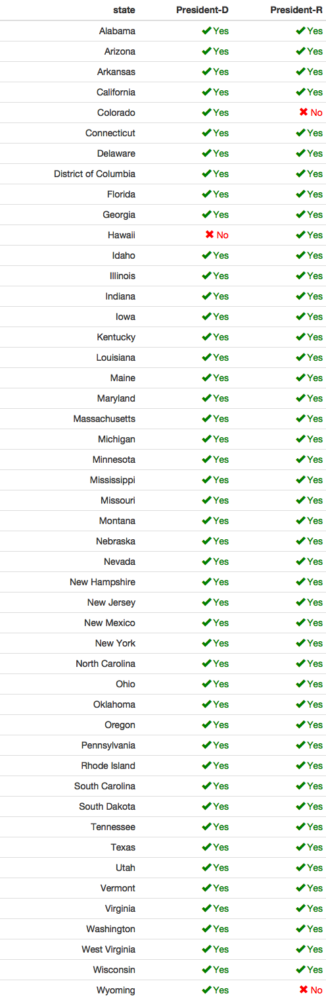
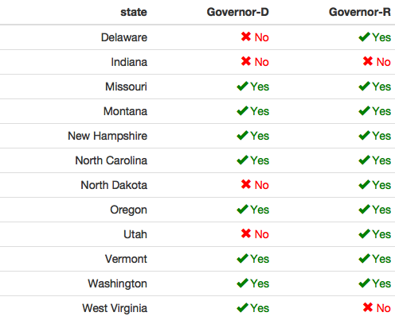

Primary Elections Data Documentation
================

Candidate-level data
--------------------

`2016_primary_long` has vote and vote share at the candidate level, for state-wide candidate races (President, Senate, Governor)

    ## # A tibble: 62,219 x 11
    ##       office    st         county  fips       candidate party  vote
    ##        <chr> <chr>          <chr> <int>           <chr> <chr> <dbl>
    ##  1 President    AL Autauga County  1001      H. Clinton     D  2387
    ##  2 President    AL Autauga County  1001      B. Sanders     D   544
    ##  3 President    AL Autauga County  1001     Uncommitted     D    42
    ##  4 President    AL Autauga County  1001 R. De La Fuente     D     6
    ##  5 President    AL Autauga County  1001     M. O'Malley     D     3
    ##  6 President    AL Autauga County  1001        D. Trump     R  5387
    ##  7 President    AL Autauga County  1001         T. Cruz     R  2482
    ##  8 President    AL Autauga County  1001        M. Rubio     R  1785
    ##  9 President    AL Autauga County  1001       B. Carson     R  1764
    ## 10 President    AL Autauga County  1001       J. Kasich     R   421
    ## # ... with 62,209 more rows, and 4 more variables: state <chr>,
    ## #   ballot <chr>, lastname <chr>, geo_race_vote_pct <dbl>

A random sample

    ## # A tibble: 10 x 11
    ##       office    st                county  fips    candidate party  vote
    ##        <chr> <chr>                 <chr> <int>        <chr> <chr> <dbl>
    ##  1 President    TX          Crane County 48103    L. Graham     R     1
    ##  2    Senate    FL        Madison County 12079    E. Rivera     R    47
    ##  3 President    MO Ste. Genevieve County 29186      K. Judd     D     1
    ##  4 President    VA      Buena Vista City 51530     M. Rubio     R   180
    ##  5 President    NH        Belknap County 33001  R. Santorum     R    13
    ##  6    Senate    OR     Hood River County 41027  M. Callahan     R   647
    ##  7 President    VA          Scott County 51169     D. Trump     R  1487
    ##  8 President    IL         Fulton County 17057     M. Rubio     R   248
    ##  9 President    ME       Somerset County    NA     D. Trump     R   270
    ## 10  Governor    MT        Granite County 30039 B. McChesney     D    46
    ## # ... with 4 more variables: state <chr>, ballot <chr>, lastname <chr>,
    ## #   geo_race_vote_pct <dbl>

County-level data
-----------------

`2016_primary_wide` has the vote share of the major presidential candidates at the county level.

    ## # A tibble: 10 x 12
    ##       office    st    state           county  fips Clinton Sanders Trump
    ##        <chr> <chr>    <chr>            <chr> <int>   <dbl>   <dbl> <dbl>
    ##  1 President    CO Colorado      Lake County  8065   0.235   0.730    NA
    ##  2 President    VA Virginia    Franklin City 51620   0.882   0.110 0.379
    ##  3 President    GA  Georgia    Barrow County 13013   0.617   0.372 0.408
    ##  4 President    TX    Texas    Cottle County 48101   0.565   0.391 0.270
    ##  5 President    IL Illinois Alexander County 17003   0.600   0.338 0.524
    ##  6 President    WY  Wyoming    Goshen County 56015   0.600   0.400    NA
    ##  7 President    MO Missouri    Camden County 29029   0.489   0.499 0.549
    ##  8 President    CO Colorado  Costilla County  8023   0.566   0.204    NA
    ##  9 President    AR Arkansas    Howard County  5061   0.765   0.185 0.345
    ## 10 President    AL  Alabama    Blount County  1009   0.551   0.386 0.487
    ## # ... with 4 more variables: Kasich <dbl>, Carson <dbl>, Cruz <dbl>,
    ## #   Rubio <dbl>

Data Construction
-----------------

Almost all of the data comes from (<https://github.com/Prooffreader/election_2016_data>), which scraped Politico election results. Most of the Politico results come from the AP feed.

Missings of Races
-----------------

Some primary races are missing due to lack of county-level data from AP. Only looking at Democratic and Republican Candidates,

### President

### Senate

### Governor

